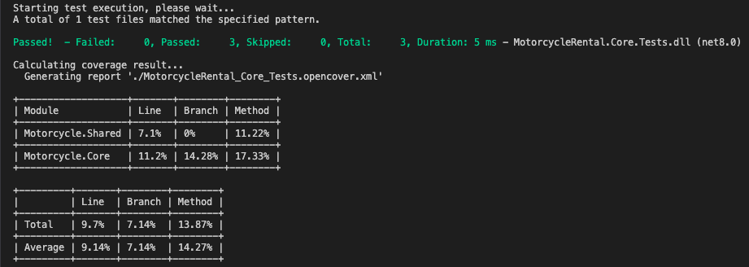
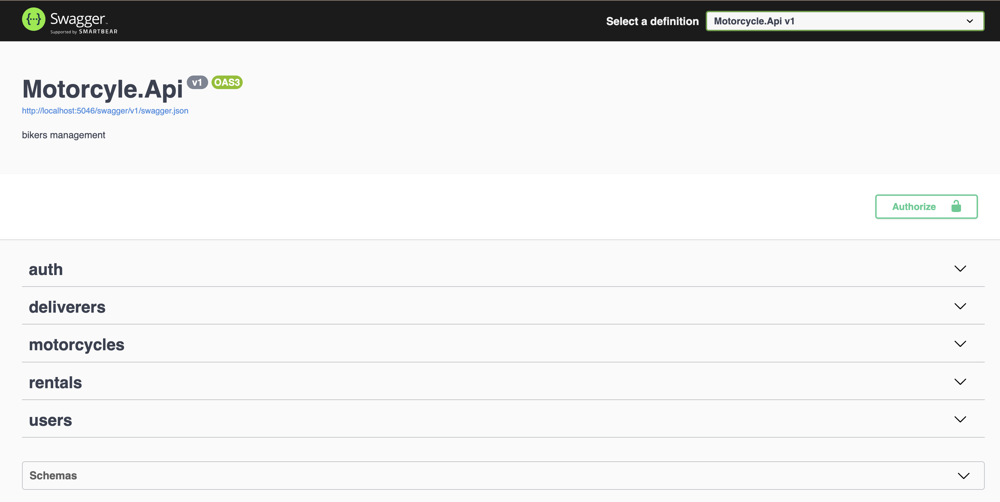
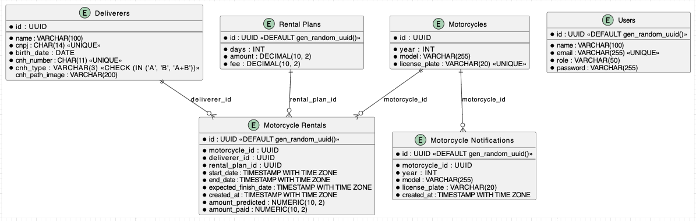
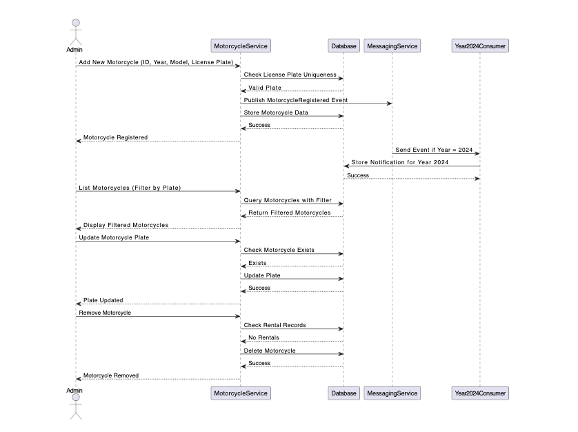
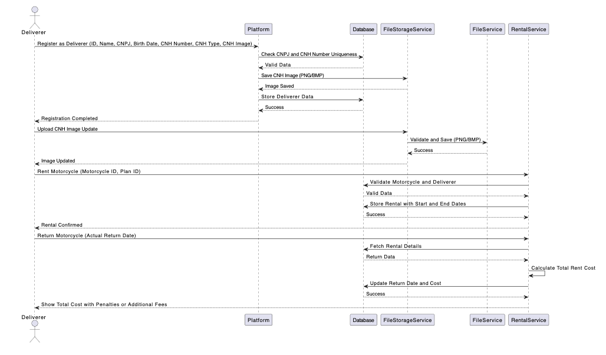
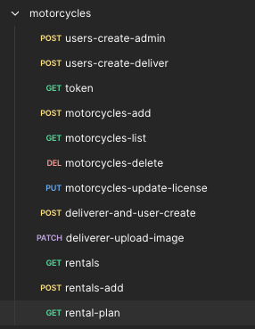

# Bikers Rental Platform

This project is a rental management system for motorcycles, designed for both administrators and deliverers. It includes features for managing motorcycles, deliverers, rental plans, and processing motorcycle rental events using RabbitMQ for messaging.

## Features

### For Admin Users:

- **Motorcycle Management**: Admins can add, update, and remove motorcycles. Each motorcycle has a unique identifier, year, model, and license plate.
- **Event Handling**: When a motorcycle is registered, an event is generated and published via RabbitMQ. A specific consumer processes events for motorcycles from the year 2024, storing them for future reference.
- **Deliverer Management**: Admins can manage deliverers with unique identifiers, CNH details, and CNPJ registration.

### For Deliverers:

- **Registration**: Deliverers can register on the platform with personal and CNH information. Valid CNH types include A, B, or A+B.
- **Motorcycle Rental**: Deliverers with a valid CNH type A can rent motorcycles under different plans (7, 15, 30, 45, or 50 days) with varying daily rates and penalties for early or late returns.
- **CNH Image Upload**: Deliverers can upload their CNH images (PNG or BMP format) stored in external storage services such as local disk, Amazon S3, or MinIO.

## Database Schema

The system uses PostgreSQL with the following main tables:

1. **Deliverers**: Stores deliverer details including CNH and CNPJ information.
2. **Motorcycles**: Manages motorcycle details such as model, year, and unique license plate.
3. **Rental Plans**: Defines rental plans with durations, costs, and penalties.
4. **Users**: Manages admin and deliverer users, with roles and authentication details.
5. **Motorcycle Rentals**: Tracks rentals with references to motorcycles, deliverers, and plans, including rental durations and financial details.
6. **Motorcycle Notifications**: Logs notifications for motorcycle events, particularly for motorcycles from the year 2024.

## Messaging System

The platform integrates with RabbitMQ for event-driven communication:

- **Event Publishing**: The application publishes motorcycle registration events to a RabbitMQ queue named `motorcycle_events`.
- **Event Consumer**: A dedicated consumer listens to the `motorcycle_events` queue, processes events, and stores relevant data in the database, specifically targeting motorcycles from the year 2024.

## Getting Started

### Prerequisites

- .NET 8
- PostgreSQL
- RabbitMQ
- Docker (optional, for containerized setup)

## Runing docker compose

## Run application

1. **Access folder motorycylerental**

   - **Run**: `docker compose up -d`

2. **Access URL**

   - **URL**: `http://localhost/swagger/index.html`

3. **Executin tests**

   - **acess folder where is .sln and Run**: `dotnet test`
     

## Swagger documentation



## Database



## Admin flow



## Deliver flow



# API Endpoints

Collection located in the docs folder as motorcycles.postman_collection.json to facilitate endpoint testing.



## Explain endpoints

## Users

1. **Create Admin User**

   - **Method**: `POST`
   - **Endpoint**: `/v1/users`
   - **Description**: Creates an admin user with the specified details.
   - **Request Body**:
     ```json
     {
       "email": "admin@mail.com",
       "name": "admin",
       "password": "123456",
       "role": "ADMIN"
     }
     ```

2. **Create Deliverer User**

   - **Method**: `POST`
   - **Endpoint**: `/v1/users`
   - **Description**: Creates a deliverer user with the specified details.
   - **Request Body**:
     ```json
     {
       "email": "deliver@mail.com",
       "name": "deliver",
       "password": "123456",
       "role": "DELIVER"
     }
     ```

3. **Generate Token**
   - **Method**: `POST`
   - **Endpoint**: `/v1/auth`
   - **Description**: Generates a token for user authentication.
     - **Request Body**:
     ```json
     {
       "email": "deliver@mail.com",
       "password": "123456"
     }
     ```

## Motorcycles

4. **Add Motorcycle**

   - **Method**: `POST`
   - **Endpoint**: `/v1/motorcycles`
   - **Description**: Adds a new motorcycle to the system.
   - **Request Body**:
     ```json
     {
       "year": 2023,
       "model": "Honda CB 500",
       "licensePlate": "ABC1234"
     }
     ```

5. **List Motorcycles**

   - **Method**: `GET`
   - **Endpoint**: `/v1/motorcycles`
   - **Description**: Retrieves a list of all motorcycles.

6. **Delete Motorcycle**

   - **Method**: `DELETE`
   - **Endpoint**: `/v1/motorcycles/{motorcycleId}`
   - **Description**: Deletes a motorcycle by its ID.
   - **Example URL**: `/v1/motorcycles/789c063d-b098-4f29-bd15-492deb2503d8`

7. **Update Motorcycle License Plate**
   - **Method**: `PUT`
   - **Endpoint**: `/v1/motorcycles/{motorcycleId}/licenseplate`
   - **Description**: Updates the license plate of a specific motorcycle.
   - **Request Body**:
     ```json
     {
       "id": "ba6f4a93-6b38-4ea6-b6ce-5240c2fb6c50",
       "licensePlate": "AAA1111"
     }
     ```

## Deliverers

8. **Create Deliverer and User**

   - **Method**: `POST`
   - **Endpoint**: `/v1/deliverers`
   - **Description**: Creates a new deliverer and associated user.
   - **Request Body**:
     ```json
     {
       "email": "john.doe@example.com",
       "name": "John Doe",
       "cnpj": "12345678987654",
       "birthDate": "1990-01-01",
       "cnhNumber": "11111111111",
       "cnhType": "A",
       "cnhPathImage": "/images/cnh/john_doe_cnh.jpg"
     }
     ```

9. **Upload CNH Image**
   - **Method**: `PATCH`
   - **Endpoint**: `/v1/deliverers/{delivererId}/cnhphoto`
   - **Description**: Uploads a CNH (driver's license) photo for a deliverer.
   - **Example URL**: `/v1/deliverers/904f0867-d0cc-4f77-a76e-69f79bcdde21/cnhphoto`
   - **Request Body**: Form-data with a file upload.

## Rentals

10. **List Rentals**

    - **Method**: `GET`
    - **Endpoint**: `/v1/rentals`
    - **Description**: Retrieves a list of all rentals.

11. **Add Rental**

    - **Method**: `POST`
    - **Endpoint**: `/v1/rentals`
    - **Description**: Adds a new rental.
    - **Request Body**:
      ```json
      {
        "motorcycleId": "ba6f4a93-6b38-4ea6-b6ce-5240c2fb6c50",
        "delivererId": "50081105-7ffc-4ac8-9795-5319f6a9d60a",
        "rentalPlanId": "a68acf27-aa01-48b6-a886-f42077e6b9d2"
      }
      ```

12. **List Rental Plans**
    - **Method**: `GET`
    - **Endpoint**: `/v1/rentals-plans`
    - **Description**: Retrieves available rental plans.

# Microservices Split To-Do List

This document outlines the steps required to split the existing monolithic system into four separate microservices: Deliverers, Rental, Motorcycles, and Users. Each microservice will be responsible for its specific domain, promoting scalability and independent development.

## To-Do: Goals

- Split the current monolithic architecture into four microservices:
  - **Deliverers Microservice**: Manages deliverer registration, validation, and updates.
  - **Motorcycles Microservice**: Manages motorcycle inventory, registration, updates, and deletions.
  - **Rental Microservice**: Handles rental operations, including booking, calculation of fees, and rental records.
  - **Users Microservice**: Manages user authentication, roles, and authorization.

## To-Do List

### 1. General Preparations

- [ ] **Define Microservices Boundaries**: Clearly define the responsibilities and boundaries of each microservice.
- [ ] **Create Repositories**: Create separate Git repositories for each microservice.
- [ ] **Set Up Common Libraries**: Extract and set up common libraries for shared functionalities (e.g., messaging, logging, error handling).
- [ ] **Database Design**: Determine if each service will have its own database or use a shared database with logical separation.

### 2. Deliverers Microservice

- [ ] **Extract Deliverers Logic**: Move all deliverer-related code (models, controllers, services) to the new microservice.
- [ ] **Database Setup**: Create a database or schema for deliverers and migrate data.
- [ ] **API Endpoints**: Define and implement API endpoints for managing deliverers (create, update, delete, fetch).
- [ ] **CNH Image Storage**: Ensure CNH images are stored in external storage (e.g., AWS S3, local disk, MinIO).
- [ ] **Integration with RabbitMQ**: Ensure the service can publish events related to deliverer updates.

### 3. Motorcycles Microservice

- [ ] **Extract Motorcycles Logic**: Move motorcycle-related code (models, controllers, services) to the new microservice.
- [ ] **Database Setup**: Create a database or schema for motorcycles and migrate data.
- [ ] **API Endpoints**: Define and implement API endpoints for managing motorcycles (create, update, delete, fetch).
- [ ] **Event Handling**: Implement event handling for motorcycle registration and notifications via RabbitMQ.
- [ ] **Unique License Plate Validation**: Ensure license plates remain unique across the system.

### 4. Rental Microservice

- [ ] **Extract Rental Logic**: Move rental-related code (models, controllers, services) to the new microservice.
- [ ] **Database Setup**: Create a database or schema for rentals and migrate data.
- [ ] **API Endpoints**: Define and implement API endpoints for managing rentals (create, update, fetch).
- [ ] **Integration with Deliverers and Motorcycles**: Implement necessary integrations to validate deliverer and motorcycle data.
- [ ] **Fee Calculation and Rules**: Implement rental fee calculations, early/late return rules, and integrate with the rental plans.

### 5. Users Microservice

- [ ] **Extract Users Logic**: Move user-related code (models, controllers, services) to the new microservice.
- [ ] **Database Setup**: Create a database or schema for users and migrate data.
- [ ] **API Endpoints**: Define and implement API endpoints for managing users (create, update, delete, fetch).
- [ ] **Authentication and Authorization**: Set up user authentication (e.g., JWT) and manage user roles (Admin, Deliverer).
- [ ] **Security**: Implement security best practices, including password hashing and secure storage.

### 6. Integration and Communication

- [ ] **Service Communication**: Set up inter-service communication (e.g., REST, gRPC, messaging via RabbitMQ).
- [ ] **API Gateway**: Implement an API Gateway to route external requests to appropriate microservices.
- [ ] **Message Broker Configuration**: Ensure all services can communicate via RabbitMQ for event-driven interactions.

### 7. Testing and Validation

- [ ] **Unit and Integration Tests**: Develop tests for each microservice to ensure functionality.
- [ ] **End-to-End Testing**: Validate end-to-end flows across microservices.
- [ ] **Performance Testing**: Test the performance of each microservice individually and collectively.

### 8. Deployment

- [ ] **Containerization**: Dockerize each microservice.
- [ ] **CI/CD Pipeline**: Set up CI/CD pipelines for each microservice.
- [ ] **Deployment Environment**: Deploy microservices to a cloud environment (e.g., Kubernetes, Docker Swarm).
- [ ] **Monitoring and Logging**: Set up monitoring and logging for all microservices.

### 9. Documentation

- [ ] **Update API Documentation**: Document API endpoints for each microservice.
- [ ] **Architecture Documentation**: Update architecture diagrams and descriptions to reflect the microservices structure.

## Additional Considerations

- **Data Consistency**: Plan for data consistency across microservices, possibly using distributed transactions or eventual consistency patterns.
- **Scalability**: Design each microservice to scale independently based on load.
- **Security**: Ensure secure communication between microservices, possibly using HTTPS and mutual TLS.

## Conclusion

Splitting the system into microservices will enhance scalability, maintainability, and allow teams to work independently on different domains. Follow the steps outlined above to successfully transition from a monolithic architecture to a microservices-based system.
